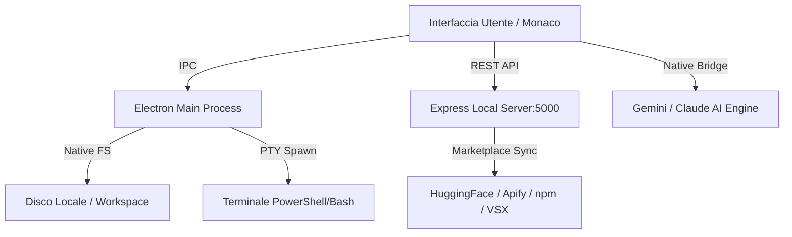

# 🚀 GXCode Studio — L'IDE AI-Nativo Professionale

**Benvenuto in GXCode Studio**, l'ambiente di sviluppo di nuova generazione progettato da **Cloud-GX** per armonizzare il codice tradizionale con i flussi di lavoro basati su Intelligenza Artificiale.

> [!IMPORTANT]
> **GXCode** non è un semplice editor; è un quartier generale per orchestratori di Agenti, Skill e Automazioni, ideato per offrire strumenti di livello enterprise in un'interfaccia fluida e moderna.

---

## 🌟 Visione del Progetto
GXCode nasce dall'esigenza di avere un IDE che non integri l'IA come semplice plugin, ma che la tratti come un "cittadino di prima classe". Grazie a un'architettura ibrida e un motore di estensioni unico, GXCode è lo strumento definitivo per lo sviluppatore moderno.

## 🏗️ Architettura & Come Lavora
GXCode opera su un'architettura a tre strati per massimizzare prestazioni e flessibilità:

1.  **Frontend (UI)**: Interfaccia dinamica realizzata in **HTML5**, **CSS moderno** e **Javascript ES6+**, ottimizzata per un rendering fluido a 60fps.
2.  **Backend (Main)**: Processo principale **Electron** che gestisce il filesystem nativo, il bridge Git e i terminali PTY interattivi.
3.  **IDE API (Server Locale)**: Un server **Express** integrato (Porta 5000) che gestisce la persistenza dei dati, il registro degli agenti e il marketplace in tempo reale.

### Schema Concettuale

---

## 🎯 Funzionalità Principali

### 🤖 Intelligenza Artificiale Integrata
- **Gemini Chat**: Integrazione nativa con modelli Flash e Pro via Google OAuth. Supporto allo storico e alla gestione contestuale.
- **Claude Code CLI**: Terminale interattivo `@anthropic-ai/claude-code` integrato direttamente nel pannello inferiore per coding assistito estremo.
- **AI Companion (Beta)**: Sezione dedicata per agenti specializzati pronti all'uso.

### 📦 Marketplace Unificato
- **Discovery Live**: Sincronizzazione in tempo reale con **Apify Store** (Agenti), **HuggingFace** (Modelli), **npm** (Skill) e **Open VSX** (Addon).
- **Gestore Skill**: Crea le tue macro-capacità in formato `SKILL.md` per estendere le conoscenze degli agenti.

### 🖥️ Strumenti di Sviluppo Professionali
- **Editor Monaco**: Il motore di VS Code integrato, con supporto per oltre 100 linguaggi e breadcrumbs di navigazione.
- **Terminale PTY reale**: Supporto multi-tab per PowerShell, CMD e Git Bash (auto-detect su Windows).
- **Git Dashboard**: Pannello completo per staging, commit, push e pull delle tue repository.
- **YouTrack Helper**: Gestione dei tuoi ticket YouTrack direttamente dalla sidebar.

---

## 🔧 Installazione & Sviluppo
Se sei un collaboratore autorizzato o vuoi visionare il codice:

1.  Assicurati di avere **Node.js 20+** installato.
2.  Clona il repository: `git clone https://github.com/Kyriga-CGX/GXCode.git`
3.  Installa le dipendenze: `npm install`
4.  Avvia l'IDE: `npm start`
5.  Build (Installer): `npm run build`

---

## 📄 Licenza & Copyright
**© 2026 Giovanni Faggiano (Cloud-GX). Tutti i diritti riservati.**

Il codice è fornito su GitHub esclusivamente a scopo dimostrativo e di visione. Non è consentita la copia, la ridistribuzione o l'uso commerciale senza l'espresso consenso scritto dell'autore.

Per maggiori dettagli, consulta il file [LICENSE](LICENSE) o visita il sito ufficiale [cloud-gx.net](https://cloud-gx.net).
