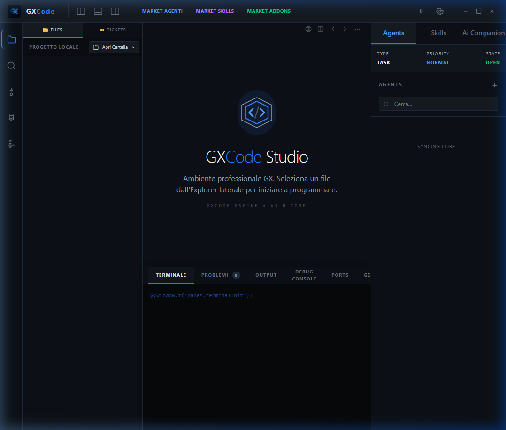
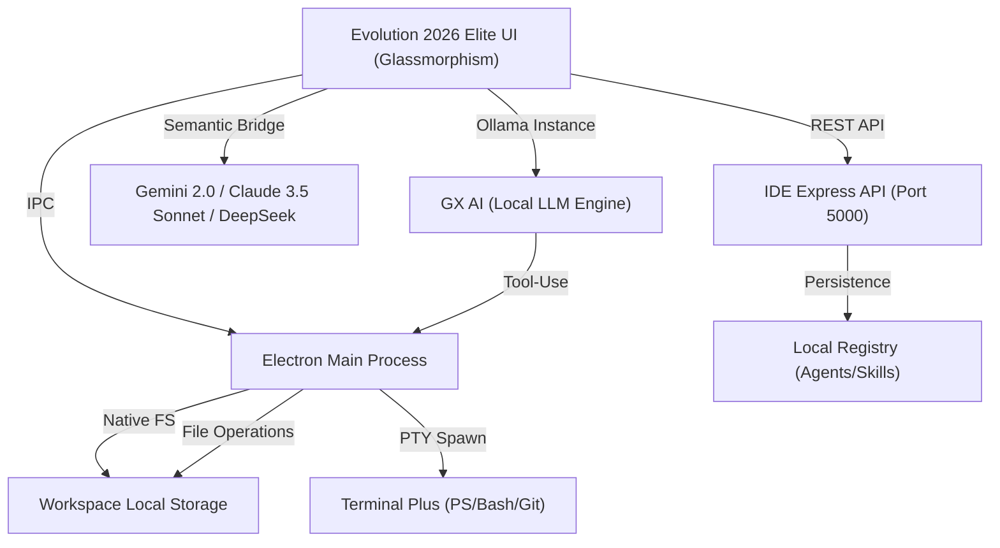

# 🚀 GXCode Studio — Evolution 2026 Elite

**Benvenuto nell'Era Elite.** GXCode Studio è l'IDE AI-Nativo di nuova generazione, progettato da **Cloud-GX** per ridefinire il concetto di sviluppo software tramite un'integrazione simbiotica tra codice umano e intelligenza artificiale locale e remota.

> [!IMPORTANT]
> Dalla versione 1.2.9, GXCode è passato all'architettura **Evolution 2026 Elite**, introducendo un'estetica industriale premium, un motore AI locale (Ollama) con capacità di tool-use avanzate e un sistema di gestione agenti/skill allo stato dell'arte.

---

## 🏗️ Schema Concettuale (Elite Architecture)

GXCode opera su un'architettura a quattro pilastri per garantire potenza, privacy e flessibilità:

---

## 🎯 Funzionalità Elite (v1.4.5)

### 🤖 Hub AI Multimodale & Locale
- **GX AI (Ollama)**: Integrazione locale profonda con supporto streaming e **Tool-Use**. L'AI può leggere, creare e modificare file nel tuo progetto in tempo reale in totale sicurezza.
- **Adaptive Engine**: Passaggio fluido tra **Gemini 2.0 Flash/Pro** e **Claude Code CLI** direttamente nel pannello integrato.
- **Prompt Guard**: Sistema di protezione contro le allucinazioni e filtri di scrittura per la massima sicurezza del codice core.

### 🎭 Snapshot Elite: Agenti & Skill
- **AI Agents**: Crea, clona e gestisci "Persona" AI specializzate con istruzioni custom e database persistente.
- **Skill Engine**: Estendi le capacità dell'AI tramite macro-istruzioni eseguibili e riutilizzabili.
- **Glow Feedback**: Illuminazione dinamica della sidebar quando una skill o un agente viene attivato dall'AI.

### 🖥️ Workspace & Terminal Plus
- **Terminal Plus**: Pannello multi-terminale con supporto per splitting, auto-detect degli ambienti (PowerShell, Bash, CMD) e shortcut professionali.
- **Monaco Elite**: Editor ultra-performante con breadcrumbs, split-view e supporto linguaggi esteso (100+ linguaggi).
- **Git Dashboard**: Gestione professionale del versioning con staging visuale, commit e sync remoto semplificato.

---

## 🗺️ Roadmap Evolution 2026

Il futuro di GXCode è già in fase di sviluppo:

- [ ] **Dedicated Tomcat Backend**: Integrazione di un server Tomcat dedicato per il debug e l'avvio immediato di applicazioni Java/Enterprise.
- [ ] **Advanced MCP Support**: Integrazione profonda del *Model Context Protocol* per connettere l'IDE a qualsiasi tool esterno.
- [ ] **Universal Plugin Registry**: Marketplace esteso per plugin di terze parti e temi custom "Elite".
- [ ] **Real-time Collaboration**: Sincronizzazione P2P per il pair programming assistito da AI.

---

## 🔧 Installazione & Sviluppo

Se sei un collaboratore autorizzato o vuoi visionare il codice:

1.  Assicurati di avere **Node.js 20+** installato.
2.  Clona il repository: `git clone https://github.com/Kyriga-CGX/GXCode.git`
3.  Installa le dipendenze: `npm install`
4.  Avvia l'IDE: `npm start`
5.  Build (Installer): `npm run build`

---

## 📄 Licenza & Copyright
**© 2026 Giovanni Faggiano (Cloud-GX). Tutti i diritti riservati.**

Il codice è fornito su GitHub esclusivamente a scopo dimostrativo e di visione. Non è consentita la copia, la ridistribuzione o l'uso commerciale senza l'espresso consenso scritto dell'autore. Per maggiori dettagli, consulta il file [LICENSE](LICENSE) o visita il sito ufficiale [cloud-gx.net](https://cloud-gx.net).
